# Neomerce

Simple vendor e-commerce web application made for Semester 4 CS3042 Database Systems Module.

## Screenshots 🖼️

| 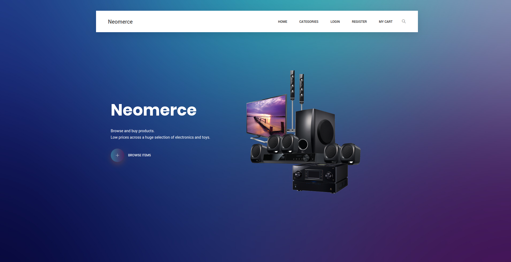                       | 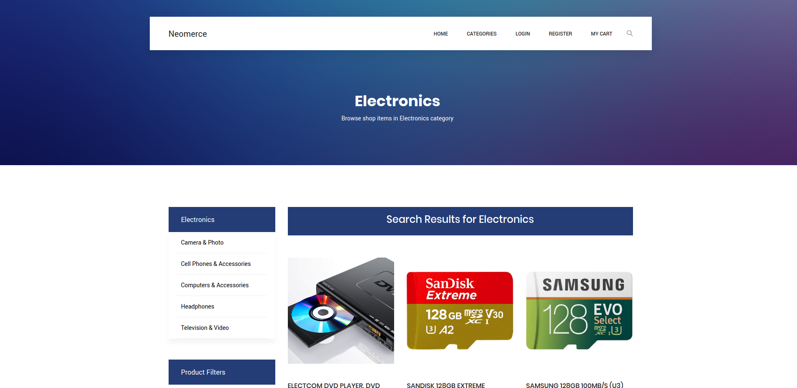              |
| -------------------------------------------------------- | ------------------------------------------------------- |
| **Home Page**                                            | **Products Page**                                       |
| 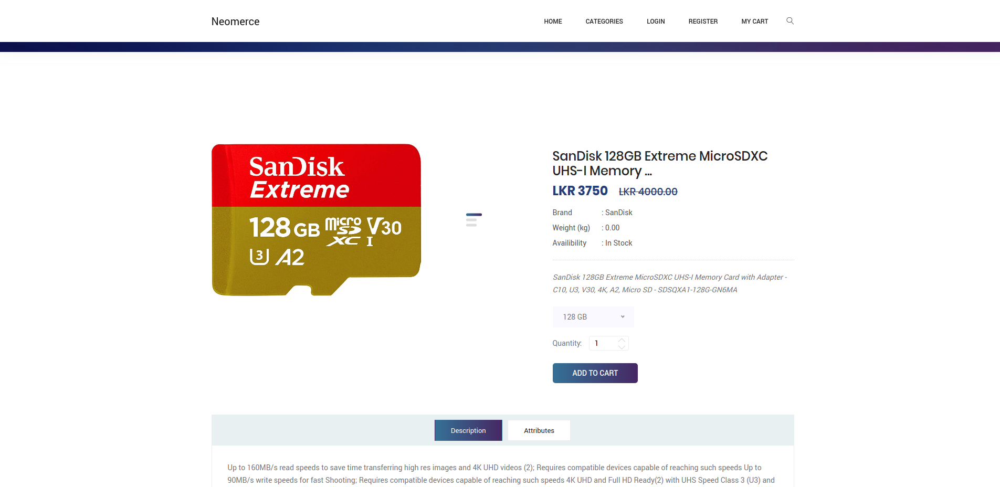          | 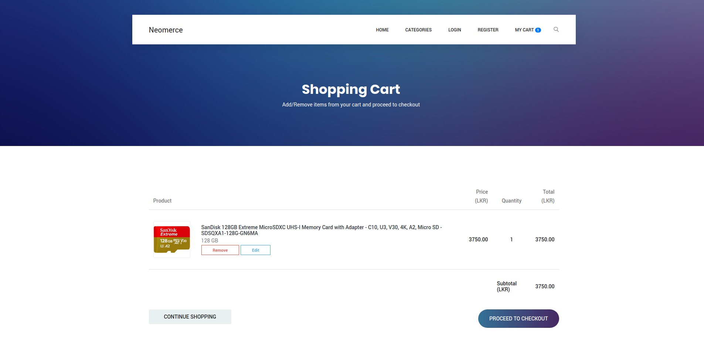                      |
| **Single Product Page**                                  | **Cart Page**                                           |
| 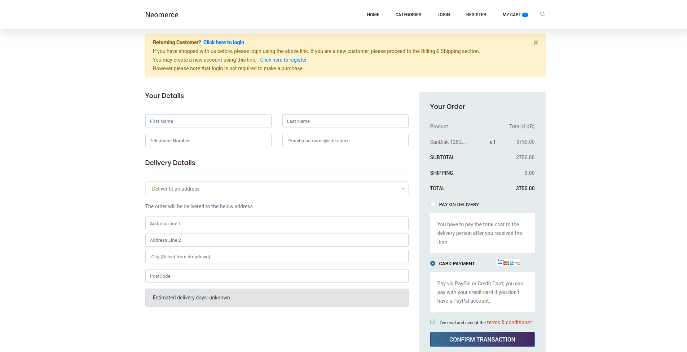               | 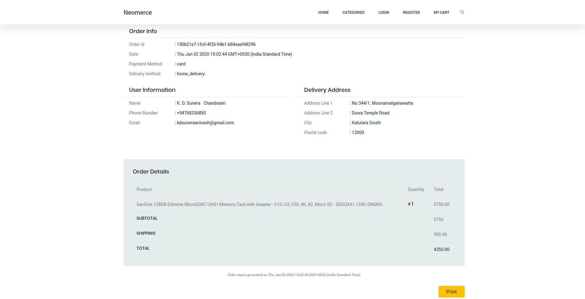                    |
| **Checkout Page**                                        | **Order Page**                                          |
| 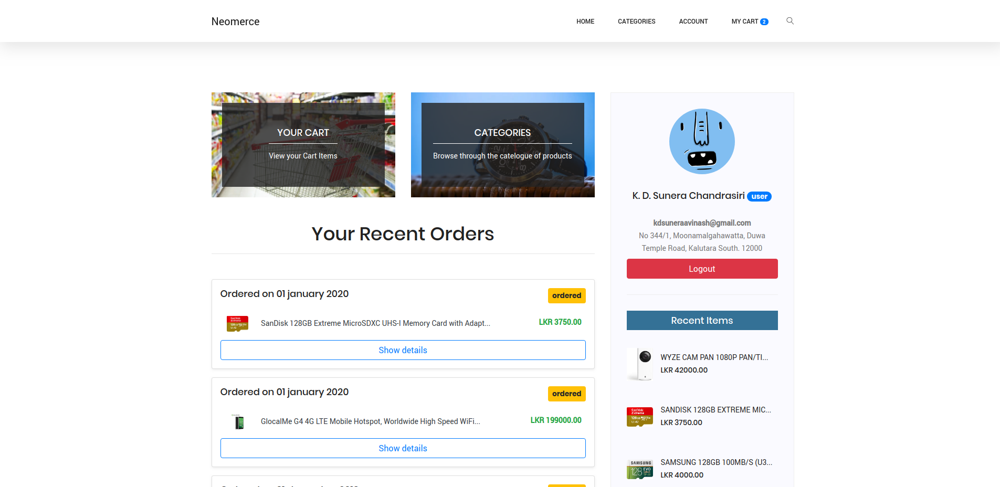                 | 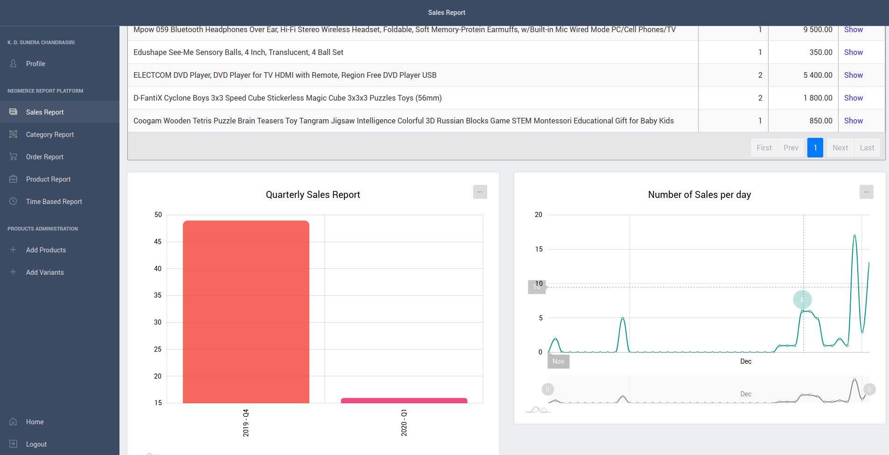      |
| **Profile Page**                                         | **Sales Report Page**                                   |
| 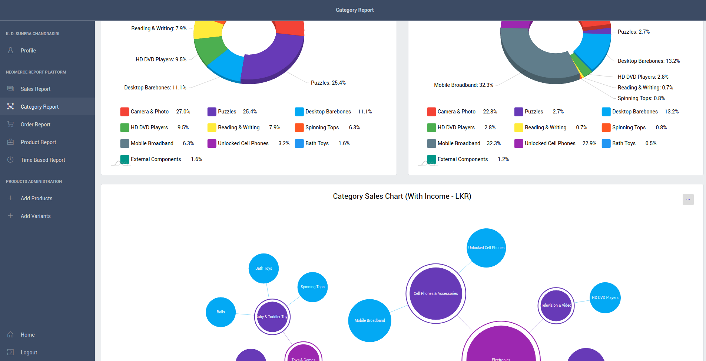 | 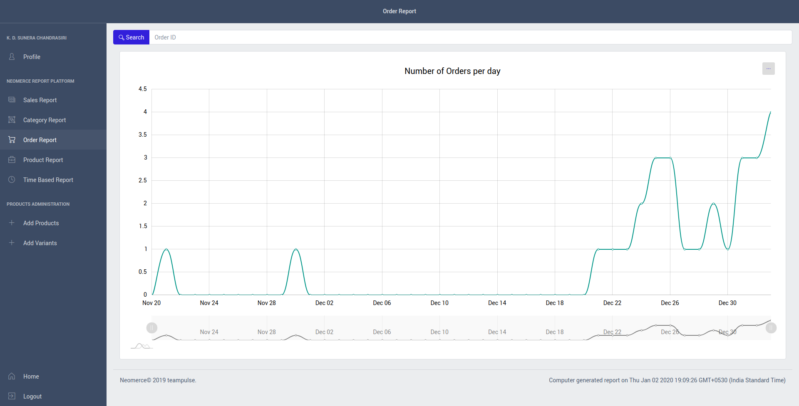      |
| **Category Report Page**                                 | **Order Report Page**                                   |
| 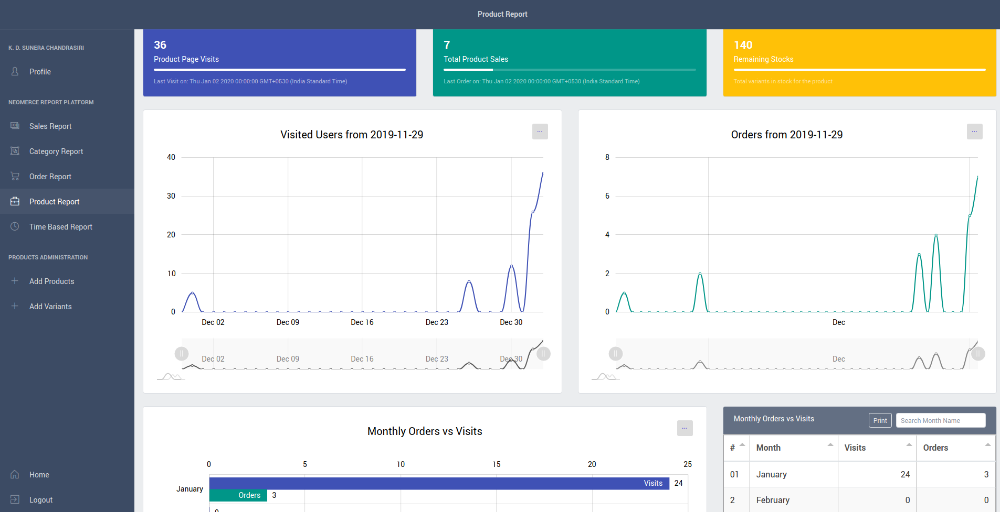   | 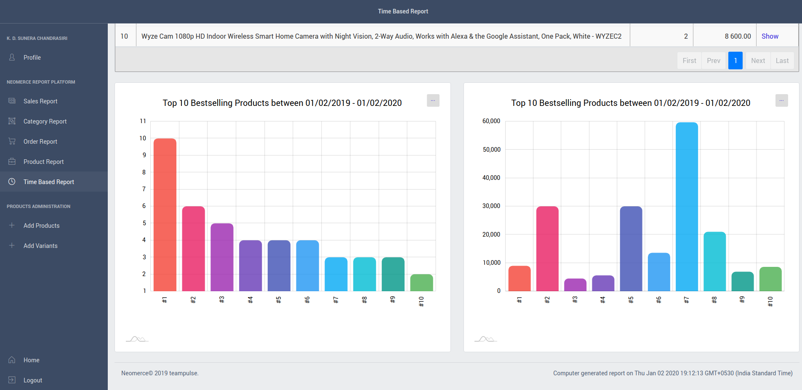 |
| **Product Report Page**                                  | **Time Period Report Page**                             |

## Guide 👨‍💻

### Database setup

Install [postgresql](https://www.postgresql.org/) in the local machine and setup correctly. Use following command to login to the `psql` shell.

```bash
psql -U postgres
```

 Then enter below commands. 

```sql
CREATE ROLE neomerce_app WITH LOGIN PASSWORD 'password';
CREATE DATABASE neomerce;
GRANT ALL PRIVILEGES ON DATABASE neomerce TO neomerce_app;
\q
```

Then login to `psql` as `neomerce_app`.

```bash
psql -U neomerce_app neomerce
```

Then in the shell, import the current DDL and DML schema.

```sql
\i database\schema.sql
\i database\insertions\1_categories.sql
\i database\insertions\2_enums.sql
\i database\insertions\3_cities.sql
\i database\insertions\4_sunera.sql
\i database\insertions\5_anju.sql
\i database\insertions\6_kasun.sql
\i database\insertions\7_attributes.sql
\q
```

### Node.js setup

First clone this project directory.

```bash
git clone https://github.com/kdsuneraavinash/neomerce
```

Install 

* [node.js v10.17.0 dubnium](https://nodejs.org/en/) 
* [yarn](https://yarnpkg.com/en/docs/install)
* [nodemon](https://www.npmjs.com/package/nodemon)

```bash
sudo pacman -S nodejs-lts-dubnium
sudo pacman -S yarn
npm install -g nodemon
```

 After that `cd` to the project directory and run `yarn install`.

```bash
cd directory/project
yarn install
```

Then create a `.env` file in the root with following content.
You may change database user/password/secret as you may wish.

```
DATABASE_USER=neomerce_app
DATABASE_NAME=neomerce
DATABASE_PASSWORD=password
DATABASE_PORT=5432
DATABASE_HOST=localhost

SESSION_SECRET=secret
PORT=3000
SERVER_ADDRESS=127.0.0.1
SALT=35cdlahj3k5sun3raeoi21kn0ano9iuhlop
```

Then use `nodemon` or `node` to serve the pages.

```bash
nodemon start # If nodemon is installed
node index.js # otherwise
```

Now visit http://localhost:3000/ and confirm that site is running.

To make a user admin, run following query in `psql` console. Use the user email address instead of `admin@neomerce.com`

```sql
call makeAdmin('admin@neomerce.com'); 
```

### VS Code Setup

Install `ESLint` library. 

Edit settings and set `editor.detectIndentation` to `false`.

## Dependencies ⬇

List of direct dependencies and dev-dependencies.

### Direct Dependencies

| Library Name      | Functionality                                                |
| ----------------- | ------------------------------------------------------------ |
| `@hapi/joi`       | Data description language and data validator for JavaScript  |
| `cors`            | Providing a Connect/Express middle-ware that can be used to enable CORS. |
| `dotenv`          | loads environment variables from a `.env` file into `process.env` |
| `ejs`             | Template Engine for node.js                                  |
| `express`         | web framework for node.js                                    |
| `express-session` | Session middleware for express                               |
| `pg`              | Non-blocking PostgreSQL client for Node.js                   |
| `uuid`            | Simple, fast generation of RFC4122 UUIDS.                    |
| `bcrypt`          | A library to help in hashing passwords.                      |
| `body-parser`     | Node.js body parsing middleware used to validate form inputs in the backend. |
| `ouch`            | Error handler and reporter                                   |

### Dev Dependencies

| Library Name                | Functionality                                                |
| --------------------------- | ------------------------------------------------------------ |
| `eslint`                    | for identifying and reporting on patterns found in ECMAScript/JavaScript code |
| `eslint-config-airbnb-base` | Airbnb's base JS .eslintrc                                   |
| `eslint-plugin-import`      | prevent issues with misspelling of file paths and import names |

### Frontend Dependencies

We used [this](https://colorlib.com/preview/#karma) template as the starting point for the user e-commerce site view. [This](https://coreui.io/) was used for admin dashboard.

Other than that, following libraries/frameworks were used for frontend.

`vue`, `jquery`, `bootstrap`, `jquery.nice-select`, `jquery.sticky`, `nouislider`, `jquery.magnific-popup`, `owl.carousel`, `pace`, `font-awesome`, `linearicons`, `rangeSlider`, `window-date-picker`, `autocomplete`, `amcharts`, `tabulator`, `jspdf`

## Problem Statement ❔

```
Single Vendor E-Commerce Platform
---------------------------------

C is a local chain retailer in Texas. Over the years, they were able to acquire a significant
customer base mainly by providing an efficient and reliable service. With Amazon becoming a
threat to almost every retailer nationwide, C is now considering to reach the technology side
as an effort of keeping up with the competition. C is family owned and currently run by the
brothers. They see the lack of online presence is a major issue with C in comparison to
Amazon. In order to overcome this, C has decided to hire a team of experts to analyse and
design a e-commerce platform for the store. The company maintains own stock in several
warehouses and already has a courier service subsidiary which takes care of delivery
functions. The target of the company is to have a better visibility within Texas. In the initial
phase C is considering to populate the platform with only a subset of all the commodities in
offered in the retailer. Given that there are over 10,000 different products currently offered in
their stores, the company decided to only offer consumer electronics and toys in the first
phase.
As per the requirement, system must first hold details about different products. Each product
has at least one variant. A variant defines a specific variety of a product. For an example,
iPhone X is the product while 16GB and 32GB are product variants. Also colors Black and
Red are too variants for the iPhone. Depending on the variant, the price of the product vary.
If the product has no varieties, it will have the default variant which will contain the price of it.
Moreover each product will have a SKU assigned by the warehouse. Each product belongs to
one or more categories. The product catalog of the system would use categories for search
and sort the products for the user. Some categories are Mobile, Speakers, etc. Each category
can also have sub categories. While there are few common attributes of products, such as
title, sku, weight etc. each product need the freedom to define its own custom attributes. Since
the system supports online purchase of the products, the inventory of the products need to be
managed by the system as well. Inventory would essentially maintain a count of the availability
from each product variant. To simply the initial design, consider that all products are stored
only in one warehouse. When a customer browse the platform, he/she could either register
with the platform or browse as a guest. Customer could add products to the cart without
completing any purchase. When product selection is done, he/she could checkout the cart. At
this moment the cart turns to an order and the cart is emptied. Every order should contain the
customer contact detail in extent (for logged in users, this can be taken from their already
provided information). Apart from that, delivery method (store pickup, delivery) and payment
method (cash on delivery or card) must be specified. Once a checkout is completed, the
inventory must reflect the changes. Consistency in transactions (inventory counts) must be
considered when validating purchases.
Apart from these C, requires a comprehensive report system for monitoring and analytics of
the platform. The reports include:
    ● Quarterly sales report for a given year
    ● Products with most number of sales in a given period
    ● Product category with most orders
    ● Given a product, time period with most interest to it
    ● Customer - order report
Additionally, a delivery module needs to be created which shows the approximate delivery
times for a given product. The rules for the module are a follows
    ● If product has stock, delivery is to a main city (ex: Colombo), it’s 5 days
    ● If product has stock, but delivery is not to a main city (ex: Negombo), it’s 7 days
    ● If product has no stock add 3 days each of the above cases
    ● Delivery estimate should appear in order when it’s in checkout
These information need to be states with the product and with the order when checking out.
As experts of database design, you are hired first analyse the requirement and propose a
database design to encapsulate all the above functionalities. In order to test the functioning
of the database, a simple UI is required.
Task
Your task is to model the database design to encapsulate these requirement. It should
consider all entities and relationships given in the description. Moreover you need to identify
the places where procedures, functions and triggers can be employed to guarantee ACID
properties. Foreign keys and primary keys must be set to maintain consistency. Indexing
should be done when necessary.
Additionally, the you must get a domain idea by reading related material and take assumptions
when not explicitly provided. The database must be populated with at least 40 products, with
variants and at least 10 different categories. These data insertions can be done manually and
no need of UI components just for the task of data input.
```

